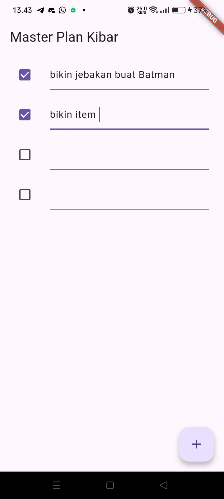
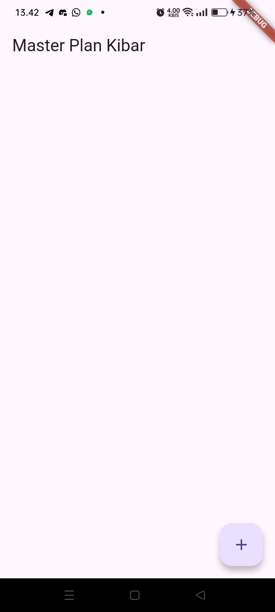
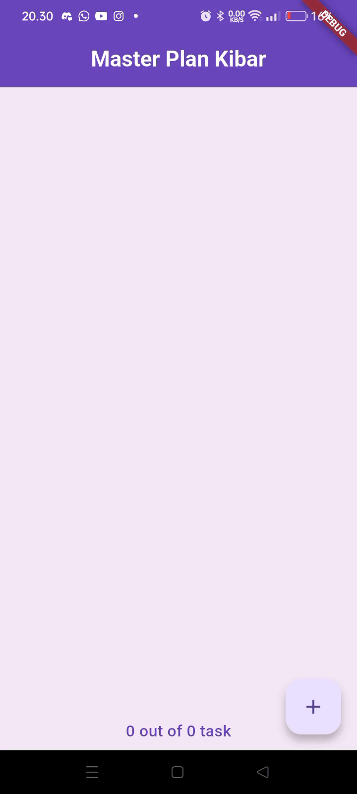
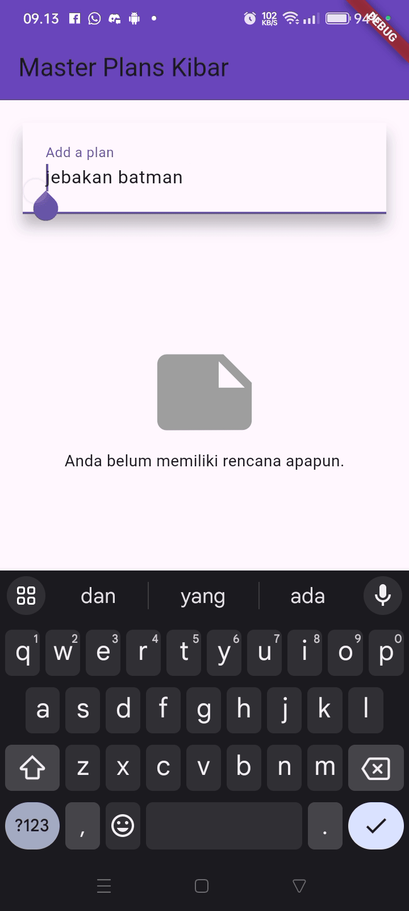

# Tugas praktikum 1 
1. Jelaskan maksud dari langkah 4 pada praktikum tersebut! Mengapa dilakukan demikian?
    - File data_layer.dart dibuat untuk menggabungkan (membungkus) beberapa file model (plan.dart, task.dart) ke dalam satu pintu ekspor.

2. Mengapa perlu variabel plan di langkah 6 pada praktikum tersebut? Mengapa dibuat konstanta ?
    - Variabel plan digunakan untuk menyimpan objek dari class Plan. dan mengapa menggunakan konstanta karena objek Plan tidak berubah referensinya selama aplikasi berjalan. dan const memastikan bahwa objek dibuat hanya sekali di memori, tidak  perlu dibuat ulang setiap kali widget dibangun ulang.

3. Lakukan capture hasil dari Langkah 9 berupa GIF, kemudian jelaskan apa yang telah Anda buat!
    

    

4. Apa kegunaan method pada Langkah 11 dan 13 dalam lifecyle state ? 
    - initState() digunakan untuk menyiapkan resource sebelum widget aktif.

    - dispose() digunakan untuk membersihkan resource setelah widget selesai digunakan.
    

# Tugas praktikum 2
1. Jelaskan mana yang dimaksud InheritedWidget pada langkah 1 tersebut! Mengapa yang digunakan InheritedNotifier?
    - Karena InheritedNotifier adalah versi khusus dari InheritedWidget yang terintegrasi dengan objek Listenable seperti ValueNotifier.
    Artinya, widget turunannya akan otomatis rebuild ketika data di ValueNotifier berubah, tanpa perlu memanggil setState() manual di setiap widget.

2. Jelaskan maksud dari method di langkah 3 pada praktikum tersebut! Mengapa dilakukan demikian?
    - Kedua method ini merupakan getter yang menambahkan business logic ke dalam model Plan.
Mereka membantu menghitung dan menampilkan informasi kemajuan dari daftar tugas (Task).

        completedCount
        Menghitung berapa banyak task yang sudah selesai (task.complete == true). Menggunakan method .where() untuk memfilter task yang sudah selesai, lalu menghitung jumlahnya dengan .length.
3. Lakukan capture hasil dari Langkah 9 berupa GIF, kemudian jelaskan apa yang telah Anda buat!

# Tugas praktikum 3 
1. Berdasarkan Praktikum 3 yang telah Anda lakukan, jelaskan maksud dari gambar diagram berikut ini!
    - Sisi Kiri (Blok Biru) Ini adalah kondisi sebelum navigasi.Blok ini menunjukkan widget tree (susunan widget) dari layar yang sedang aktif, yaitu PlanCreatorScreen.Berdasarkan nama dan strukturnya (memiliki TextField dan ListView), layar ini kemungkinan besar adalah formulir untuk membuat atau mengedit sebuah rencana (plan). Pengguna bisa mengetik sesuatu di TextField dan mungkin melihat daftar item di ListView.

    - Panah "Navigator Push", Ini adalah aksi/metode yang dieksekusi.Navigator. push adalah perintah standar di Flutter untuk "mendorong" (push) sebuah layar (route) baru ke atas tumpukan navigasi. Aksi ini biasanya dipicu oleh interaksi pengguna, seperti menekan tombol "Simpan", "Tambah", atau "Selesai" pada PlanCreatorScreen.

    - Sisi Kanan (Blok Hijau) Ini adalah kondisi setelah navigasi Blok ini menunjukkan widget tree dari layar baru yang sekarang aktif dan terlihat oleh pengguna, yaitu PlanScreenPlanScreen "menggantikan" PlanCreatorScreen di tampilan (meskipun PlanCreatorScreen masih ada di tumpukan di bawahnya, siap untuk kembali jika pengguna menekan "kembali").Berdasarkan strukturnya (memiliki Scaffold, ListView, dan Text), layar ini kemungkinan adalah layar yang menampilkan daftar rencana yang sudah dibuat.

2. Lakukan capture hasil dari Langkah 14 berupa GIF, kemudian jelaskan apa yang telah Anda buat!

