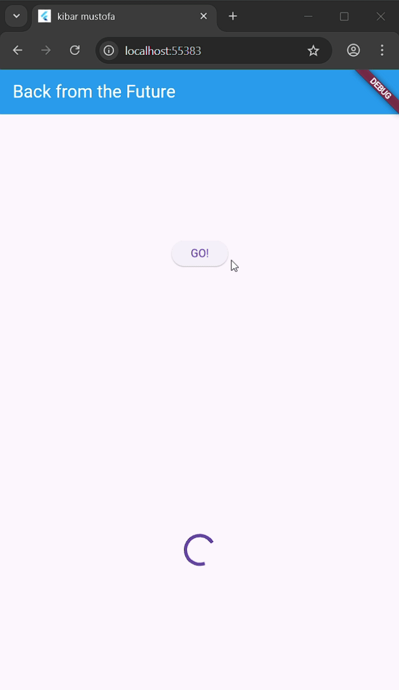
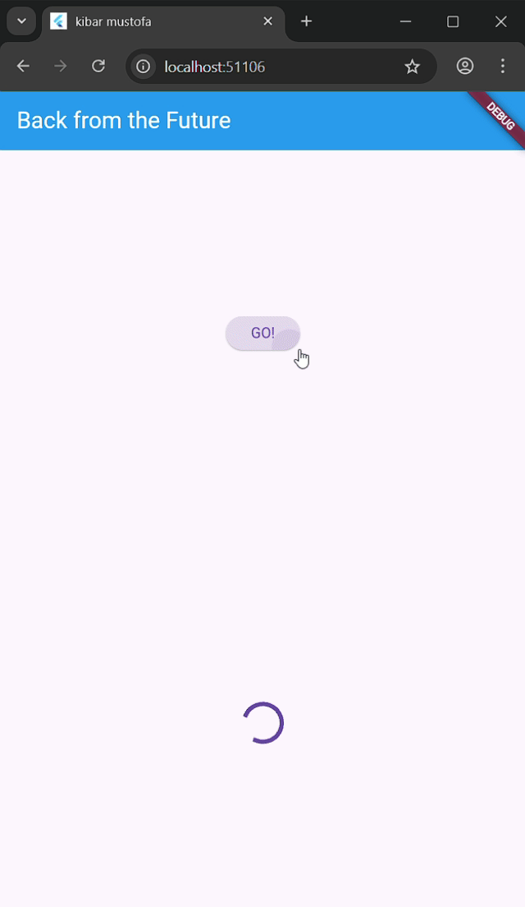
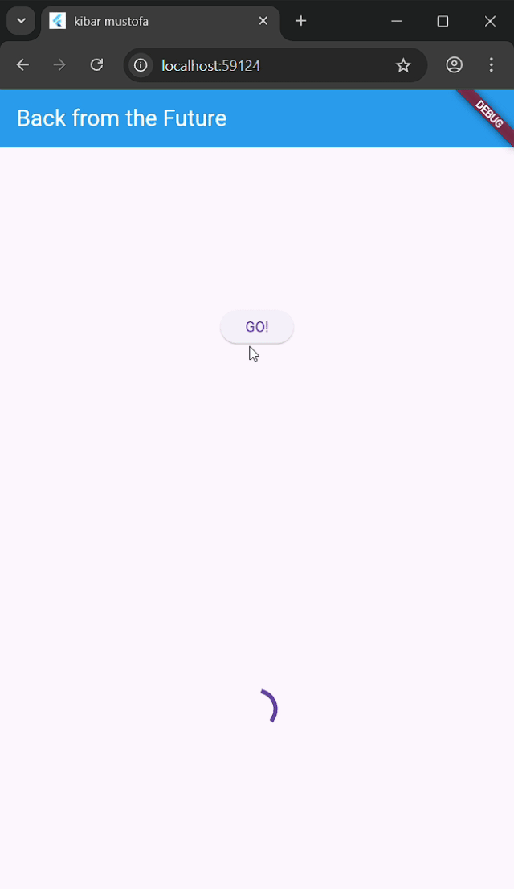
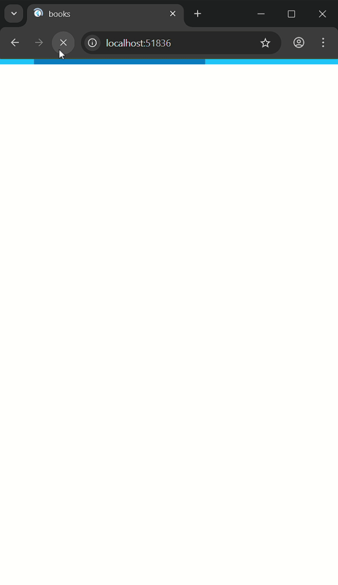
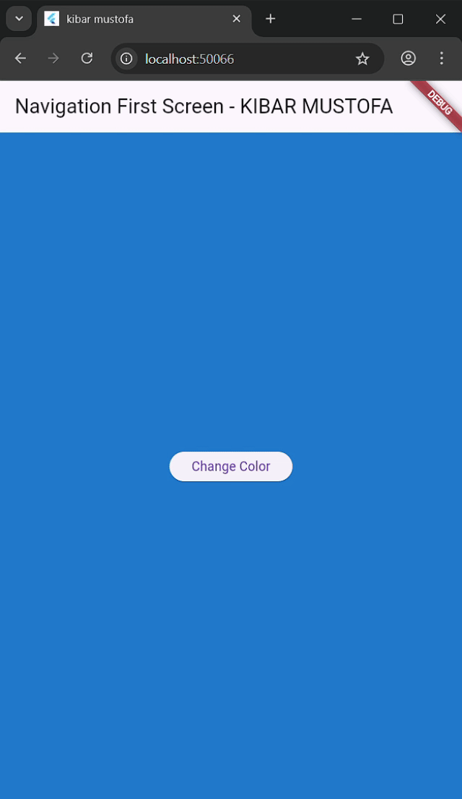
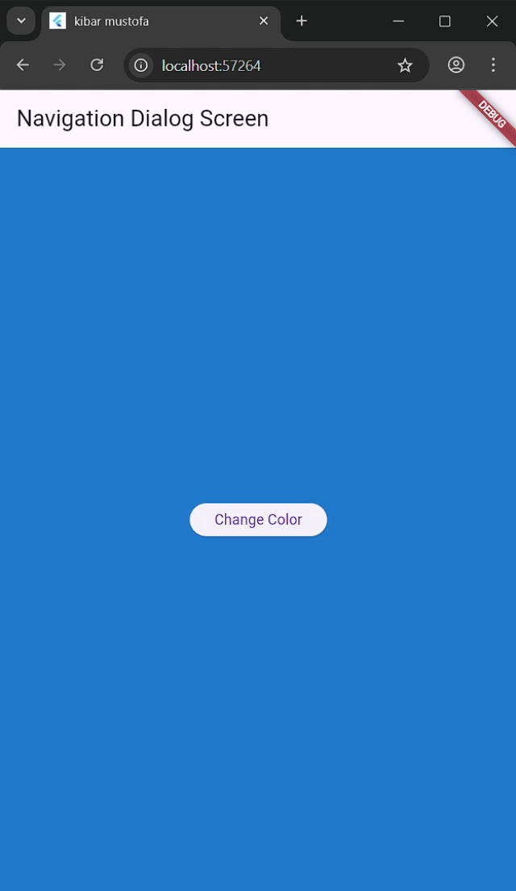

# Codelab 11

# Praktikum 1 

## Soal 3
1. Jelaskan maksud kode langkah 5 tersebut terkait substring dan catchError!

   Jawab :

   `substring(0, 450)` berfungsi memotong teks JSON sehingga hanya bagian awal (450 karakter pertama) yang ditampilkan.  
   Tujuannya agar tampilan lebih ringkas, tidak terlalu panjang, dan tetap rapi saat ditampilkan di layar.

2. Capture hasil praktikum Anda berupa GIF dan lampirkan di README. Lalu lakukan commit dengan pesan "W11: Soal 3"

   Jawab :

   

# Praktikum 2

## Soal 4

1. Jelaskan maksud kode langkah 1 dan 2 tersebut!

   Jawab :

   Ketiga method (`returnOneAsync()`, `returnTwoAsync()`, dan `returnThreeAsync()`) dibuat untuk mensimulasikan proses asynchronous.  
   Masing-masing menunggu selama 3 detik sebelum menghasilkan nilai 1, 2, dan 3.  
   Contoh ini menunjukkan penggunaan `async`–`await` tanpa memanfaatkan callback `.then()`. Proses baru selesai setelah delay selesai dijalankan.

2. Capture hasil praktikum Anda berupa GIF dan lampirkan di README. Lalu lakukan commit dengan pesan "W11: Soal 4"

   Jawab :

   

# Praktikum 3

## Soal 5

1. Jelaskan maksud kode langkah 2 tersebut!

   Jawab :

   `Completer` digunakan untuk membuat `Future` secara manual.  
   Method `getNumber()` membuat `Completer<int>()` dan memulai proses perhitungan melalui `calculate()`.  
   Method `calculate()` berjalan asynchronous, menunggu 5 detik, kemudian menyelesaikan `Future` yang dibuat oleh `Completer`.

2. Capture hasil praktikum Anda berupa GIF dan lampirkan di README. Lalu lakukan commit dengan pesan "W11: Soal 5".

   Jawab :

   

## Soal 6

1. Jelaskan maksud perbedaan kode langkah 2 dengan langkah 5-6 tersebut!

   Jawab :

   Perbedaan utamanya terletak pada cara menangani error.  
   Langkah 2 belum memiliki penanganan kesalahan, sementara langkah 5–6 sudah menambahkan proses error handling sehingga error yang terjadi dapat ditangani secara lebih aman.

2. Capture hasil praktikum Anda berupa GIF dan lampirkan di README. Lalu lakukan commit dengan pesan "W11: Soal 6".

   Jawab :

   

# Praktikum 4

## Soal 7

1. Capture hasil praktikum Anda berupa GIF dan lampirkan di README. Lalu lakukan commit dengan pesan "W11: Soal 7".

   Jawab :

   

## Soal 8

1. Jelaskan maksud perbedaan kode langkah 1 dan 4!

   Jawab :

   - **Langkah 1 — FutureGroup**

     Digunakan ketika ingin mengelola kumpulan Future secara manual.  
     Future ditambahkan satu per satu, lalu setelah `close()`, semua Future diproses paralel.  
     Cocok untuk kondisi di mana jumlah Future bersifat dinamis.  
     Hasilnya berupa `List<int>` setelah seluruh Future selesai.

   - **Langkah 4 — Future.wait**

     Cara yang lebih singkat untuk menjalankan beberapa Future secara paralel.  
     Cukup memberikan list Future seperti `Future.wait([f1, f2, f3])`, dan semuanya diproses otomatis.  
     Cocok untuk jumlah Future yang tetap dan lebih mudah digunakan dalam kebanyakan kasus.

# Praktikum 5

## Soal 9

1. Capture hasil praktikum Anda berupa GIF dan lampirkan di README. Lalu lakukan commit dengan pesan "W11: Soal 9".

   Jawab :

   

## Soal 10

1. Panggil method handleError() tersebut di ElevatedButton, lalu run. Apa hasilnya? Jelaskan perbedaan kode langkah 1 dan 4!

   Jawab :

   Saat tombol **GO!** ditekan, method `handleError()` dijalankan.  
   `returnError()` menunggu 2 detik lalu melempar exception.  
   Bagian `catch(error)` menangkap pesannya dan menampilkan:

   *"Exception: Something terrible happened!"*

   Bagian `finally` tetap dijalankan sehingga menghasilkan output:

   *Complete*

   Setelah itu, indikator loading berhenti karena variabel `loading` kembali menjadi `false`.

# Praktikum 6

## Soal 12

1. Apakah Anda mendapatkan koordinat GPS ketika run di browser? Mengapa demikian?

   Jawab :

   Tidak, biasanya browser tidak memberikan akses GPS seperti perangkat Android/iOS.  
   Plugin `geolocator` didesain untuk device mobile, sehingga ketika dijalankan di browser, ia tidak dapat mengambil data sensor GPS secara langsung.

2. Capture hasil praktikum Anda berupa GIF dan lampirkan di README. Lalu lakukan commit dengan pesan "W11: Soal 12".

   Jawab :

   
   

# Praktikum 7

## Soal 13

1. Apakah ada perbedaan UI dengan praktikum sebelumnya? Mengapa demikian?

   Jawab :

   Secara tampilan tidak banyak berubah, namun kini menggunakan `FutureBuilder`.  
   Dengan `FutureBuilder`, UI otomatis diperbarui berdasarkan status Future tanpa membutuhkan pemanggilan `setState()` secara manual.

## Soal 14

1. Apakah ada perbedaan UI dengan langkah sebelumnya? Mengapa demikian?

   Jawab :

   Ya, ketika terjadi error, UI menampilkan pesan khusus seperti *"Something terrible happened!"*.  
   Ini terjadi karena sekarang memanfaatkan `snapshot.hasError`, sehingga error ditangani lebih terkontrol di tampilan.

   

# Praktikum 8

## Soal 15

1. Tambahkan nama panggilan Anda pada tiap properti title sebagai identitas pekerjaan Anda.

   Jawab :

   Nama panggilan yang ditambahkan: **Gabriel Batavia**.

2. Silakan ganti dengan warna tema favorit Anda.

## Soal 16

1. Cobalah klik setiap button, apa yang terjadi? Mengapa demikian?

   Jawab :

   Ketika memilih salah satu warna pada screen kedua, halaman tersebut akan ditutup dan kembali ke screen pertama.  
   Warna yang dipilih dikembalikan melalui `Navigator.pop(context, someColor)`.  
   Di screen pertama, nilai tersebut diterima sebagai hasil dari `await Navigator.push`, kemudian digunakan untuk memperbarui background melalui `setState()`.

   

# Praktikum 9

## Soal 17

1. Cobalah klik setiap button, apa yang terjadi ? Mengapa demikian ?

   Jawab :

   Saat sebuah warna dipilih, warna tersebut dikirim kembali menggunakan `Navigator.pop`, kemudian screen sebelumnya memperbarui tampilannya berdasarkan warna yang diterima.

2. Capture hasil praktikum Anda berupa GIF dan lampirkan di README. Lalu lakukan commit dengan pesan "W11: Soal 17".

   Jawab :

   
