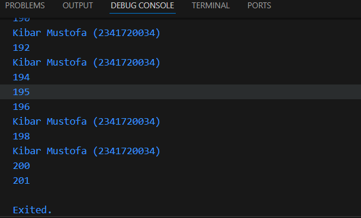

# PEMROGRAMAN MOBILE Pertemuan 3
#
Nama  : Kibar Mustofa

Kelas : TI3F

Absen : 17

NIM   : 2341720034


# Praktikum 1: Menerapkan Control Flows ("if/else")

### Langkah 1:
Ketik atau salin kode program berikut ke dalam fungsi main().
```
String test = "test2";
if (test == "test1") {
   print("Test1");
} else If (test == "test2") {
   print("Test2");
} Else {
   print("Something else");
}

if (test == "test2") print("Test2 again");
```


### Langkah 2:
Silakan coba eksekusi (Run) kode pada langkah 1 tersebut. Apa yang terjadi? Jelaskan!
- pada percobaan kali ini jadi pertama kita membuat deklarasi test dan menginisialisasi dan memberikan nilai awal test2, jadi karena yang dipanggil adalah test2 maka dari percanbangan if/else akan melakukan print 2.


### Langkah 3:
```
// kode tambahan
  String test2 = "true";
  if (test2) {
    print("Kebenaran");
  }
}
```
Tambahkan kode program berikut, lalu coba eksekusi (Run) kode Anda.
- sebelum


#
- sesudah


- pada if, while, dan pernyataan kondisi lainnya di Dart wajib menggunakan ekspresi yang bertipe boolean.jadi
Saat Anda menulis if (test2) dan test2 adalah String, Dart tidak tahu apakah ini true atau false, jadi error.

# Praktikum 2: Menerapkan Perulangan "while" dan "do-while"

### Langkah 1:
Ketik atau salin kode program berikut ke dalam fungsi main().
```
while (counter < 33) {
  print(counter);
  counter++;
}
```
- sebelum 


#
- sesudah


### Langkah 2:
Silakan coba eksekusi (Run) kode pada langkah 1 tersebut. Apa yang terjadi? Jelaskan! Lalu perbaiki jika terjadi error.
- ketika di run akan error karena kita belum melakukan melakukan deklarasi pada counter dan menginisialisasikannya, jadi perlu melakukan langkah tersebut agar dapat menjalankan baris kode tersebut 

### Langkah 3:
Tambahkan kode program berikut, lalu coba eksekusi (Run) kode Anda.

``` 
String test = "true";
if (test) {
   print("Kebenaran");
}
```
Apa yang terjadi ? Jika terjadi error, silakan perbaiki namun tetap menggunakan do-while.

 

- hasil tetap akan melakukan perhitungan hingga 72, karena bila sesuai dengan baris kode yang saya praktikan maka sesuai urutan dari baris kode akan menjalankan while terlebih dahulu yang artinya akan mencetak hasil 0-33 dan di susul oleh do-while dari 33-76.

# Praktikum 3: Menerapkan Perulangan "for" dan "break-continue"

### Langkah 1: 
Ketik atau salin kode program berikut ke dalam fungsi main().

```
for (Index = 10; index < 27; index) {
  print(Index);
}
```
 

### Langkah 2:
Silakan coba eksekusi (Run) kode pada langkah 1 tersebut. Apa yang terjadi? Jelaskan! Lalu perbaiki jika terjadi error. 

- pada percobaan kali ini ada banyak permasalahan seperti belum melakukan deklarasi pada index, lalu pada penulisan index yang huruf awalnya tidak konsisten besar/kecilnya, dan increment seharusnya index++ dan kode berikut akan melakukan print dimulai dari 10 dan melakukan print hingga kurang dari 27. 

- sesudah perbaikan 
 

### Langkah 3:
Tambahkan kode program berikut di dalam for-loop, lalu coba eksekusi (Run) kode Anda.
```
If (Index == 21) break;
Else If (index > 1 || index < 7) continue;
print(index);
```
Apa yang terjadi ? Jika terjadi error, silakan perbaiki namun tetap menggunakan for dan break-continue.

 

- error terjadi karena adanya kesalahan pada penulisan control flows if else yang harusnya tidak menggunakan huruf kapital, lalu untuk kode jika digabung maka untuk `index = 10 `dan ` index < 27,` tetapi setelah itu If `(Index == 21) break;` maka yang akan di cetak adalah 10-20 saja.

# 5. Tugas Praktikum
1. Silakan selesaikan Praktikum 1 sampai 3, lalu dokumentasikan berupa screenshot hasil pekerjaan beserta penjelasannya!
- sudah saya tampilkan pada percobaan" sebelumnya

2. Buatlah sebuah program yang dapat menampilkan bilangan prima dari angka 0 sampai 201 menggunakan Dart. Ketika bilangan prima ditemukan, maka tampilkan nama lengkap dan NIM Anda.
- jawaban:


- lanjutan



