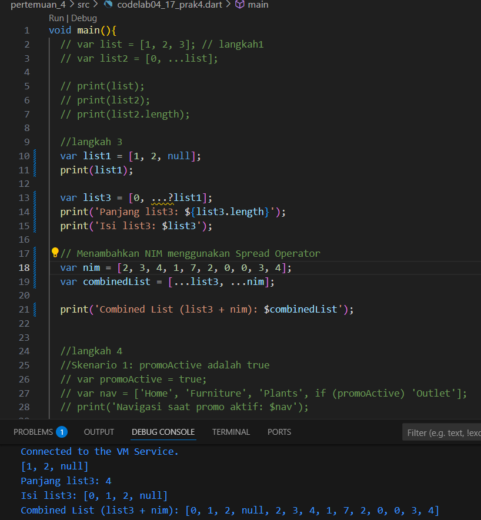
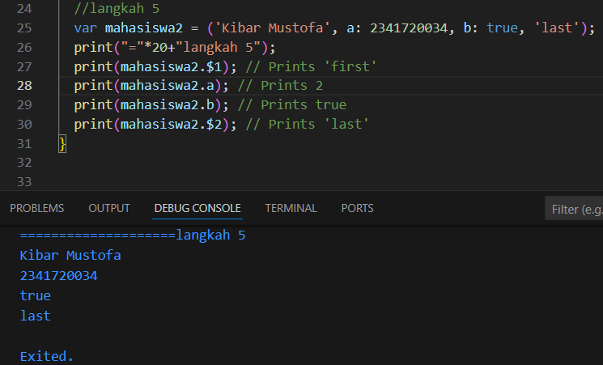

# PEMROGRAMAN MOBILE Pertemuan 3
#
Nama  : Kibar Mustofa

Kelas : TI3F

Absen : 17

NIM   : 2341720034

## PRAKTIKUM1 
#

## Langkah 1: Eksperimen Tipe Data List

Ketik atau salin kode program berikut ke dalam void main().
```
var list = [1, 2, 3];
assert(list.length == 3);
assert(list[1] == 2);
print(list.length);
print(list[1]);

list[1] = 1;
assert(list[1] == 1);
print(list[1]);
```

## hasil praktikum 1


## Langkah 2:
Silakan coba eksekusi (Run) kode pada langkah 1 tersebut. Apa yang terjadi? Jelaskan!
- jadi pada percobaan praktikum tersebut list ditampung berisi 1,2,3 dan lenght 3 dan kondisi intinya untuk hasil print yang di cetak adalah  
- print(list.length);: Mencetak panjang dari list, yaitu 3.

- print(list[2]);: Mencetak nilai pada indeks ke-2 (elemen ketiga) dari list, yaitu 3.

- print(list[1]);: Mencetak nilai baru pada indeks ke-1, yaitu 1.

## langkah 3: 

Ubah kode pada langkah 1 menjadi variabel final yang mempunyai index = 5 dengan default value = null. Isilah nama dan NIM Anda pada elemen index ke-1 dan ke-2. Lalu print dan capture hasilnya.

Apa yang terjadi ? Jika terjadi error, silakan perbaiki.
```
Catatan:

Dart akan melakukan infers pada variabel list dengan tipe data List. Jika Anda mencoba menambahkan elemen berupa objek non-integer pada list, maka analyzer atau runtime akan error. Informasi lebih lanjut dapat membaca di tautan ini type inference.
```
hasil percobaan:


## PRAKTIKUM 2: Eksperimen Tipe Data Set
#

## langkah 1: 
Ketik atau salin kode program berikut ke dalam fungsi main().
```
var halogens = {'fluorine', 'chlorine', 'bromine', 'iodine', 'astatine'};
print(halogens);
```

## Langkah 2:
Silakan coba eksekusi (Run) kode pada langkah 1 tersebut. Apa yang terjadi? Jelaskan! Lalu perbaiki jika terjadi error.

hasil kode:
 
- tidak ada error yang terjadi dan hasil mencetak variabel halogens

## langkah 3: 
Tambahkan kode program berikut, lalu coba eksekusi (Run) kode Anda.
```
var names1 = <String>{};
Set<String> names2 = {}; // This works, too.
var names3 = {}; // Creates a map, not a set.

print(names1);
print(names2);
print(names3);
```
Apa yang terjadi ? Jika terjadi error, silakan perbaiki namun tetap menggunakan ketiga variabel tersebut. Tambahkan elemen nama dan NIM Anda pada kedua variabel Set tersebut dengan dua fungsi berbeda yaitu .add() dan .addAll(). Untuk variabel Map dihapus, nanti kita coba di praktikum selanjutnya.

Dokumentasikan code dan hasil di console, lalu buat laporannya.

hasil awal kode tanpa modifikasi :
 

hasil sesudah modifikasi :
 

- pada percobaan kali ini hasil pertama akan menampilkan variabel kosong karena kita belum melakukan set atau memberikan isian pada name 1,2 dan 3. lalu setelah modifikasi kita dapat menggunakan add dan addall untuk mengisi variabel set kalau add hanya 1 inputan sedangkan addall menambahkan lebih dari satu.

## Praktikum 3: Eksperimen Tipe Data Maps

## Langkah 1:
Ketik atau salin kode program berikut ke dalam fungsi main().
```
var gifts = {
  // Key:    Value
  'first': 'partridge',
  'second': 'turtledoves',
  'fifth': 1
};

var nobleGases = {
  2: 'helium',
  10: 'neon',
  18: 2,
};

print(gifts);
print(nobleGases);
```

## Langkah 2:
Silakan coba eksekusi (Run) kode pada langkah 1 tersebut. Apa yang terjadi? Jelaskan! Lalu perbaiki jika terjadi error.

 

- Saat kode pada langkah 1 dieksekusi, tidak terjadi error sama sekali. Kode tersebut berjalan dengan lancar.

## Langkah 3:
Tambahkan kode program berikut, lalu coba eksekusi (Run) kode Anda.
```
var mhs1 = Map<String, String>();
gifts['first'] = 'partridge';
gifts['second'] = 'turtledoves';
gifts['fifth'] = 'golden rings';

var mhs2 = Map<int, String>();
nobleGases[2] = 'helium';
nobleGases[10] = 'neon';
nobleGases[18] = 'argon';
Apa yang terjadi ? Jika terjadi error, silakan perbaiki.
```
Tambahkan elemen nama dan NIM Anda pada tiap variabel di atas (gifts, nobleGases, mhs1, dan mhs2). Dokumentasikan hasilnya dan buat laporannya!

hasil dari kode: 
 

hasil modifikasi:
 


## Praktikum 4: Eksperimen Tipe Data List: Spread dan Control-flow Operators

## Langkah 1:
Ketik atau salin kode program berikut ke dalam fungsi main().
```
var list = [1, 2, 3];
var list2 = [0, ...list];
print(list1);
print(list2);
print(list2.length);
```

## Langkah 2:
Silakan coba eksekusi (Run) kode pada langkah 1 tersebut. Apa yang terjadi? Jelaskan! Lalu perbaiki jika terjadi error.

Error: Undefined name 'list1'.
Error ini terjadi karena variabel dideklarasikan dengan nama var list, tetapi saat dicetak menggunakan nama print(list1)

hasil dari perbaikan  :
 

## Langkah 3:
Tambahkan kode program berikut, lalu coba eksekusi (Run) kode Anda.
```
list1 = [1, 2, null];
print(list1);
var list3 = [0, ...?list1];
print(list3.length);
```
Apa yang terjadi ? Jika terjadi error, silakan perbaiki.
Tambahkan variabel list berisi NIM Anda menggunakan Spread Operators. Dokumentasikan hasilnya dan buat laporannya!

- Saat kode pada langkah 3 dijalankan, terjadi error karena variabel list1 belum pernah dideklarasikan.

hasil setelah modifikasi:
 

## Langkah 4:
Tambahkan kode program berikut, lalu coba eksekusi (Run) kode Anda.
```
var nav = ['Home', 'Furniture', 'Plants', if (promoActive) 'Outlet'];
print(nav);
```
Apa yang terjadi ? Jika terjadi error, silakan perbaiki. Tunjukkan hasilnya jika variabel promoActive ketika true dan false.

- Saat kode pada langkah 4 dijalankan, terjadi error karena variabel promoActive belum dideklarasikan.

setelah kode di perbaiki :
 

## Langkah 5:
Tambahkan kode program berikut, lalu coba eksekusi (Run) kode Anda.
```
var nav2 = ['Home', 'Furniture', 'Plants', if (login case 'Manager') 'Inventory'];
print(nav2);
```
Apa yang terjadi ? Jika terjadi error, silakan perbaiki. Tunjukkan hasilnya jika variabel login mempunyai kondisi lain.
- Saat kode pada langkah 5 dijalankan, terjadi error karena dua alasan: variabel login belum dideklarasikan, dan sintaks if (login case 'Manager') tidak valid untuk kondisi sederhana di dalam list.

perbaikan kode :
- Kita perlu mendeklarasikan variabel login dan menggunakan operator perbandingan biasa == untuk kondisi if di dalam list.
 

## Langkah 6:
Tambahkan kode program berikut, lalu coba eksekusi (Run) kode Anda.
```
var listOfInts = [1, 2, 3];
var listOfStrings = ['#0', for (var i in listOfInts) '#$i'];
assert(listOfStrings[1] == '#1');
print(listOfStrings);
```
Apa yang terjadi ? Jika terjadi error, silakan perbaiki. Jelaskan manfaat Collection For dan dokumentasikan hasilnya.

- Saat kode pada langkah 6 dijalankan, tidak terjadi error. Kode berjalan dengan sukses.
- Collection For adalah cara yang ringkas dan elegan untuk membuat sebuah list baru berdasarkan elemen dari list lain.

hasil percobaan :
 


## Praktikum 5: Eksperimen Tipe Data Records

## Langkah 1:
Ketik atau salin kode program berikut ke dalam fungsi main().
```
var record = ('first', a: 2, b: true, 'last');
print(record)
```
## Langkah 2:
Silakan coba eksekusi (Run) kode pada langkah 1 tersebut. Apa yang terjadi? Jelaskan! Lalu perbaiki jika terjadi error.
- Saat kode pada langkah 1 dieksekusi, tidak terjadi error. Kode berjalan dengan sukses. 
- Kode tersebut berhasil membuat sebuah Record. Record adalah tipe data anonim yang memungkinkan Anda untuk menggabungkan beberapa nilai dari tipe yang berbeda ke dalam satu objek.

hasil percobaan: 
 

## Langkah 3:
Tambahkan kode program berikut di luar scope void main(), lalu coba eksekusi (Run) kode Anda.
```
(int, int) tukar((int, int) record) {
  var (a, b) = record;
  return (b, a);
}
```
Apa yang terjadi ? Jika terjadi error, silakan perbaiki. Gunakan fungsi tukar() di dalam main() sehingga tampak jelas proses pertukaran value field di dalam Records.

-  hanya menambahkan definisi fungsi tukar(), tidak ada yang terjadi pada output program karena fungsi tersebut belum dipanggil. Tidak ada error dalam definisi fungsi itu sendiri.

hasil percobaan : 
 


## Langkah 4:
Tambahkan kode program berikut di dalam scope void main(), lalu coba eksekusi (Run) kode Anda.
```
// Record type annotation in a variable declaration:
(String, int) mahasiswa;
print(mahasiswa);
```
Apa yang terjadi ? Jika terjadi error, silakan perbaiki. Inisialisasi field nama dan NIM Anda pada variabel record mahasiswa di atas. Dokumentasikan hasilnya dan buat laporannya!

- Saat kode pada langkah 4 dieksekusi, terjadi error.

Penyebab Error:
```Error: Non-nullable variable 'mahasiswa' must be assigned before it can be used.```
 

hasil setelah diperbaiki:
 

## Langkah 5:
Tambahkan kode program berikut di dalam scope void main(), lalu coba eksekusi (Run) kode Anda.
```
var mahasiswa2 = ('first', a: 2, b: true, 'last');

print(mahasiswa2.$1); // Prints 'first'
print(mahasiswa2.a); // Prints 2
print(mahasiswa2.b); // Prints true
print(mahasiswa2.$2); // Prints 'last'
```
Apa yang terjadi ? Jika terjadi error, silakan perbaiki. Gantilah salah satu isi record dengan nama dan NIM Anda, lalu dokumentasikan hasilnya dan buat laporannya!

- Saat kode pada langkah 5 dieksekusi, tidak terjadi error. Kode berjalan dengan sukses dan menampilkan setiap field dari record.

- Field Posisional: Diakses menggunakan tanda dolar $ diikuti nomor posisinya (dimulai dari 1). Contoh: mahasiswa2.$1 untuk mengakses 'first'.

- Field Bernama: Diakses langsung menggunakan namanya, seperti mengakses properti pada sebuah objek. Contoh: mahasiswa2.a untuk mengakses 2.

hasil kode :
 

hasil kode modifikasi nim dan nama
 

## Tugas Praktikum
1. Silakan selesaikan Praktikum 1 sampai 5, lalu dokumentasikan berupa screenshot hasil pekerjaan Anda beserta penjelasannya!
2. Jelaskan yang dimaksud Functions dalam bahasa Dart!
- Functions (atau fungsi) adalah blok kode yang dapat digunakan kembali untuk melakukan tugas tertentu. 

3. Jelaskan jenis-jenis parameter di Functions beserta contoh sintaksnya!
- Positional Parameters (Parameter Posisional)
    Ini adalah parameter standar di mana urutan saat memanggil fungsi sangat penting.
        Sintaks:
        ```

        // 'nama' adalah parameter pertama, 'umur' adalah kedua.
        void perkenalan(String nama, int umur) {
        print('Nama saya $nama, umur saya $umur tahun.');
        }

        // Pemanggilan harus sesuai urutan
        perkenalan('Budi', 25);
        ```
- Named Parameters (Parameter Bernama)
Parameter ini dibungkus dengan kurung kurawal {}. Urutan saat memanggil tidak penting, dan nama parameter harus disebutkan. Ini membuat kode sangat mudah dibaca.

    - Secara default, parameter bernama bersifat opsional (boleh tidak diisi).
    - Gunakan required jika parameter tersebut wajib diisi.

contoh sintaksnya : 
```
// 'harga' bersifat opsional, sedangkan 'nama' wajib diisi.
void dataProduk({required String nama, double? harga}) {
  print('Produk: $nama');
  if (harga != null) {
    print('Harga: Rp $harga');
  }
}

// Pemanggilan tidak harus berurutan
dataProduk(harga: 50000, nama: 'Kemeja');
dataProduk(nama: 'Topi'); // Boleh karena harga opsional
```
- Optional Positional Parameters (Parameter Posisional Opsional)
Parameter ini dibungkus dengan kurung siku []. Mereka bersifat opsional dan harus diletakkan setelah parameter posisional yang wajib.
    contoh sintaksnya
    ```
    void cetakAlamat(String jalan, [String? kota, String? negara = 'Indonesia']) {
    print('Jalan: $jalan');
    if (kota != null) {
        print('Kota: $kota');
    }
    print('Negara: $negara'); // Memiliki nilai default
    }

    cetakAlamat('Jl. Soekarno Hatta');
    cetakAlamat('Jl. Gajah Mada', 'Malang');
    ```

4. Jelaskan maksud Functions sebagai first-class objects beserta contoh sintaknya!
- Functions sebagai First-Class Objects
Ini adalah konsep penting di Dart. Artinya, fungsi diperlakukan sama seperti objek lain (misalnya String atau int). Sebuah fungsi bisa:
- Disimpan dalam sebuah variabel.
- Diberikan sebagai argumen ke fungsi lain.
- Dikembalikan sebagai hasil dari fungsi lain.


5. Apa itu Anonymous Functions? Jelaskan dan berikan contohnya!
- Aanonymous Function (juga dikenal sebagai lambda atau closure) adalah fungsi yang tidak memiliki nama. Fungsi ini sangat berguna untuk tugas-tugas singkat dan sering digunakan sebagai argumen untuk fungsi lain (seperti forEach, map, atau where).
6. Jelaskan perbedaan Lexical scope dan Lexical closures! Berikan contohnya!
- Lexical Scope
Lexical Scope berarti jangkauan (scope) sebuah variabel ditentukan oleh lokasinya di dalam kode. Sebuah fungsi dapat mengakses variabel di dalam lingkupnya sendiri dan juga di lingkup induknya (di luarnya). Anggap saja seperti kotak di dalam kotak 
- Lexical Closures
Lexical Closure adalah sebuah fungsi yang "mengingat" lingkup leksikal tempat ia dibuat, bahkan ketika fungsi tersebut dieksekusi di luar lingkup aslinya. Ia "menutup" (closes over) variabel-variabel di sekitarnya. seperti tas yang menyimpan barang semua barang itu tetap ada di dalamnya

7. Jelaskan dengan contoh cara membuat return multiple value di Functions!
Return Multiple Values (Mengembalikan Banyak Nilai)
Cara modern dan paling direkomendasikan untuk mengembalikan beberapa nilai dari sebuah fungsi di Dart adalah dengan menggunakan Records. dengan Records tipe data anonim yang dapat menggabungkan beberapa nilai menjadi satu objek.
