# PEMROGRAMAN MOBILE Pertemuan 5
#
Nama  : Kibar Mustofa

Kelas : TI3F

Absen : 17

NIM   : 2341720034

## Praktikum 1: Membuat Project Flutter Baru

## Langkah 1:
Buka VS Code, lalu tekan tombol Ctrl + Shift + P maka akan tampil Command Palette, lalu ketik Flutter. Pilih New Application Project.

## Langkah 2:
Kemudian buat folder sesuai style laporan praktikum yang Anda pilih. Disarankan pada folder dokumen atau desktop atau alamat folder lain yang tidak terlalu dalam atau panjang. Lalu pilih Select a folder to create the project in.

## Langkah 3:
Buat nama project flutter hello_world seperti berikut, lalu tekan Enter. Tunggu hingga proses pembuatan project baru selesai.

## Langkah 4:
Jika sudah selesai proses pembuatan project baru, pastikan tampilan seperti berikut. Pesan akan tampil berupa "Your Flutter Project is ready!" artinya Anda telah berhasil membuat project Flutter baru.

hasil dari praktikum 1:
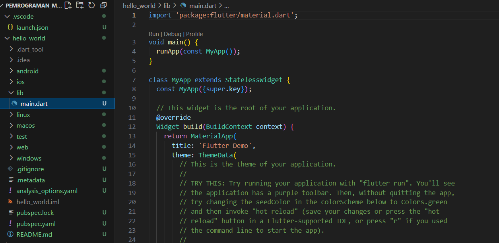

- pada percobaan kali ini membuat projek aplikasi baru di vscode

## Praktikum 2: Menghubungkan Perangkat Android atau Emulator
Melanjutkan dari praktikum 1, Anda diminta untuk menjalankan aplikasi ke perangkat fisik (device Android atau iOS). Silakan ikuti langkah-langkah pada codelab tautan berikut ini.

https://developer.android.com/codelabs/basic-android-kotlin-compose-connect-device?hl=id#0


## Mengaktifkan proses debug USB
Agar Android Studio dapat berkomunikasi dengan perangkat Android, Anda harus mengaktifkan proses debug USB di setelan Opsi developer di perangkat.

Untuk menampilkan opsi developer dan mengaktifkan Proses debug USB:

1. Di perangkat Android, ketuk Settings > About phone.
2. Ketuk Build number tujuh kali.
3. Jika diminta, masukkan sandi atau PIN perangkat. Anda tahu Anda telah berhasil saat melihat pesan You are now a developer!.
4. Kembali ke Settings, lalu ketuk System > Developer options.
5. Jika Anda tidak melihat Developer options, ketuk Advanced options.


## Menginstal Driver USB Google (khusus Windows)

1. Di Android Studio, klik Tools > SDK Manager. Dialog Preferences > Appearance & Behavior > System Settings > Android SDK akan terbuka.
2. Klik tab SDK Tools.
3. Pilih Google USB Driver, lalu klik OK.

hasil installasi google USB Driver 
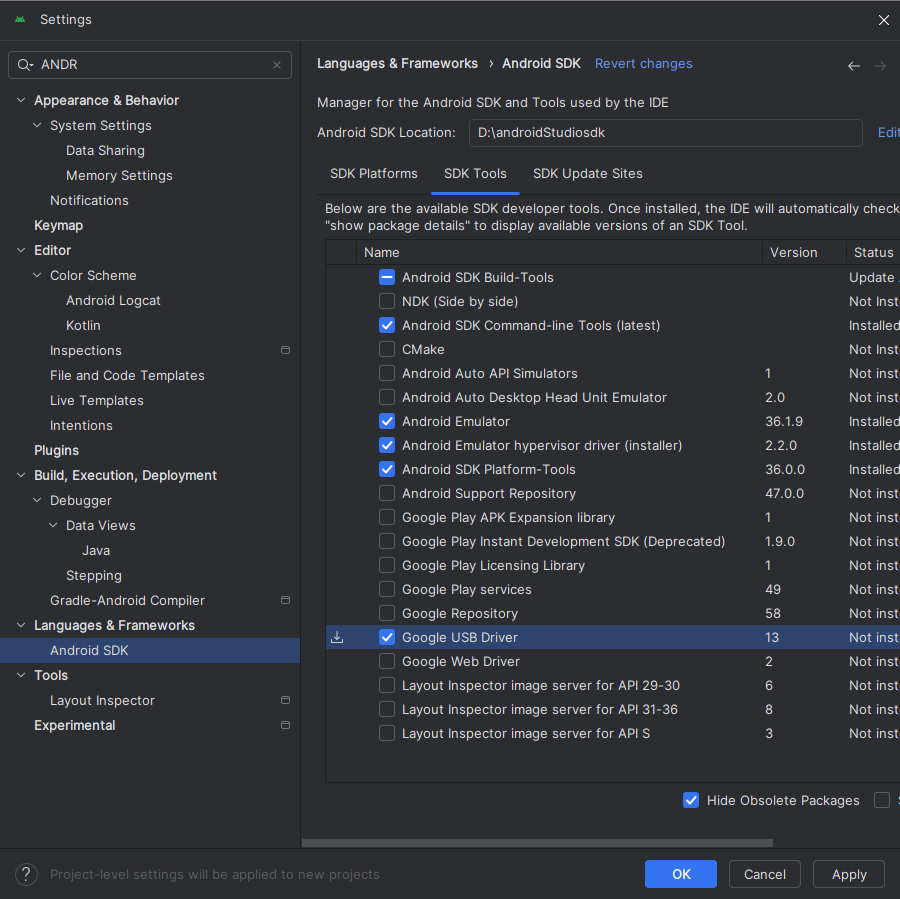
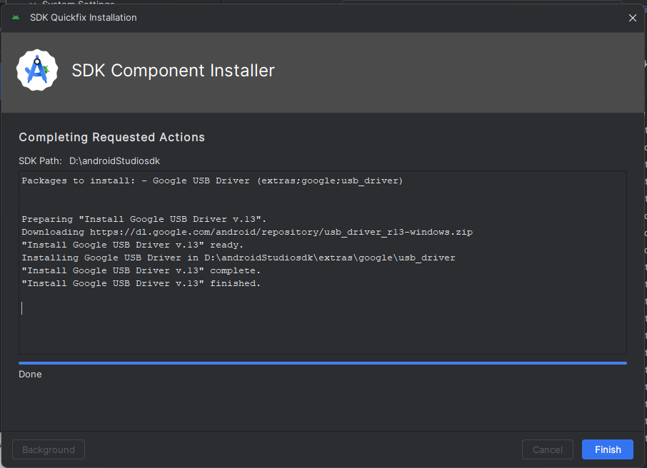

## Menjalankan aplikasi di perangkat Android menggunakan kabel
Ada dua cara untuk menghubungkan perangkat ke Android Studio, melalui kabel atau Wi-Fi. Anda dapat memilih cara mana pun yang Anda sukai.

Untuk menjalankan aplikasi dari Android Studio di perangkat Android:

1. Sambungkan perangkat Android ke komputer menggunakan kabel USB. Dialog yang meminta Anda mengizinkan proses debug USB akan muncul di perangkat.

2. Pilih kotak centang Always allow from this computer, lalu ketuk OK.
3. Di Android Studio di komputer, pastikan perangkat Anda dipilih di menu dropdown. Klik Ini adalah ikon Run Android Studio.
4. Pilih perangkat lalu klik OK. Android Studio akan menginstal aplikasi di perangkat, lalu menjalankannya.
```
Catatan: Untuk Android Studio 3.6 dan versi yang lebih baru, perangkat fisik akan otomatis dipilih saat terhubung dengan proses debug yang aktif.
```
5. Jika perangkat menjalankan platform Android yang tidak diinstal di Android Studio dan melihat pesan berisi pertanyaan apakah Anda ingin menginstal platform yang diperlukan, klik Install > Continue > Finish. Android Studio akan menginstal aplikasi di perangkat, lalu menjalankannya.

hasil installasi google USB Driver 
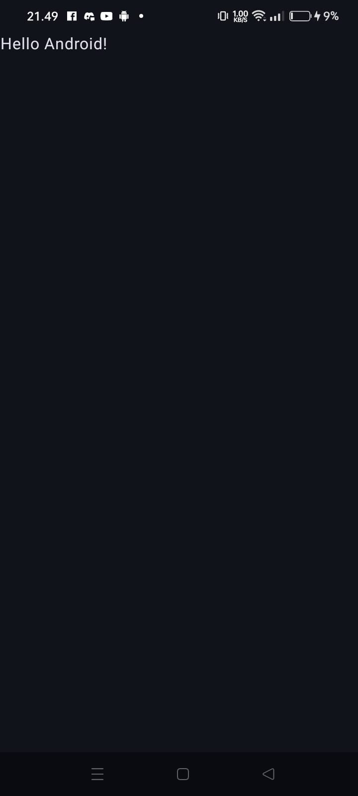 
- Berikut jika aplikasi berjalan setelah debugging.


- aplikasi dengan icon android muncul di beranda.

## Praktikum 3: Membuat Repository GitHub dan Laporan Praktikum
```
Perhatian: Diasumsikan Anda telah mempunyai akun GitHub dan Anda telah memahami konsep dasar dalam bekerja menggunakan Git pada pertemuan pertama.

Praktikum ini dapat Anda lewati langsung ke langkah 11 jika sudah paham cara membuat laporan praktikum sesuai style yang Anda pilih.
```
- jadi pada bagian ini saya lewaati dan lanjut pada langkah 11

## Langkah 11:
Kembali ke VS Code, ubah platform di pojok kanan bawah ke emulator atau device atau bisa juga menggunakan browser Chrome. Lalu coba running project hello_world dengan tekan F5 atau Run > Start Debugging. Tunggu proses kompilasi hingga selesai, maka aplikasi flutter pertama Anda akan tampil seperti berikut.

berikut hasil run debug ketika menggunakan chrome di vscode :
- pilih terlahih dahulu debuging via apa dengan memilih bagian kanan bawah. 


## Praktikum 4: Menerapkan Widget Dasar
Selesaikan langkah-langkah praktikum berikut ini dengan melanjutkan dari praktikum sebelumnya.

## Langkah 1: Text Widget
Buat folder baru basic_widgets di dalam folder lib. Kemudian buat file baru di dalam basic_widgets dengan nama ``text_widget.dart``. Ketik atau salin kode program berikut ke project hello_world Anda pada file ``text_widget.dart``.

```
import 'package:flutter/material.dart';

class MyTextWidget extends StatelessWidget {
  const MyTextWidget({Key? key}) : super(key: key);

  @override
  Widget build(BuildContext context) {
    return const Text(
      "Nama saya Fulan, sedang belajar Pemrograman Mobile",
      style: TextStyle(color: Colors.red, fontSize: 14),
      textAlign: TextAlign.center);
  }
}
```
Lakukan import file text_widget.dart ke main.dart, lalu ganti bagian text widget dengan kode di atas. Maka hasilnya seperti gambar berikut. Screenshot hasil milik Anda, lalu dibuat laporan pada file README.md.

hasil dari langkah 1: 
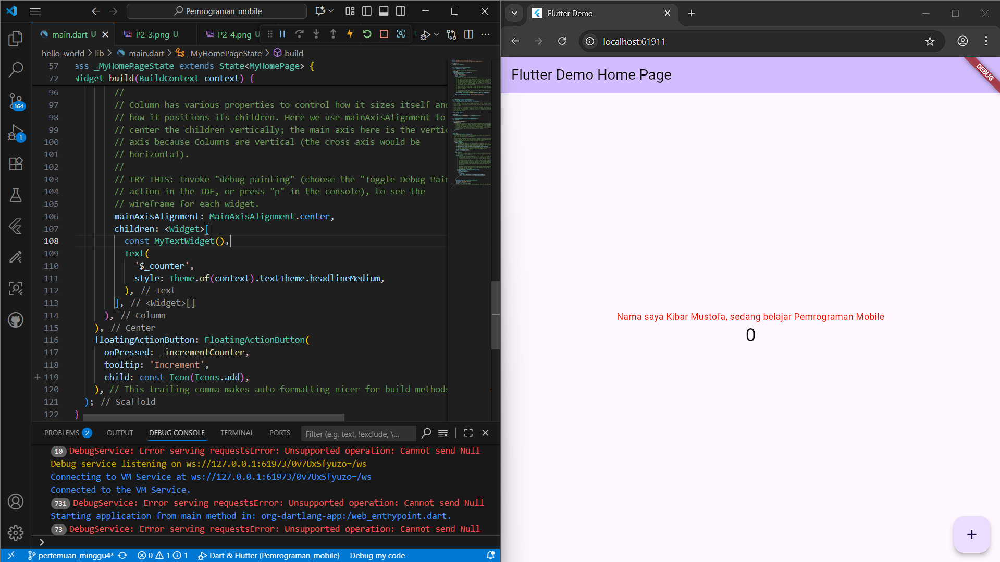

## Langkah 2: Image Widget
Buat sebuah file ``image_widget.dart`` di dalam folder basic_widgets dengan isi kode berikut.
```
import 'package:flutter/material.dart';

class MyImageWidget extends StatelessWidget {
  const MyImageWidget({Key? key}) : super(key: key);

  @override
  Widget build(BuildContext context) {
    return const Image(
      image: AssetImage("logo_polinema.jpg")
    );
  }
}
```
Lakukan penyesuaian asset pada file pubspec.yaml dan tambahkan file logo Anda di folder assets project hello_world.
```
flutter:
  assets:
     - logo_polinema.jpg
```
Jangan lupa sesuaikan kode dan import di file main.dart kemudian akan tampil gambar seperti berikut.

hasil langkah 2: 

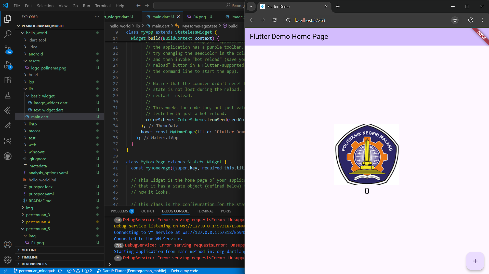

## Praktikum 5: Menerapkan Widget Material Design dan iOS Cupertino

Buat file di basic_widgets > loading_cupertino.dart. Import stateless widget dari material dan cupertino. Lalu isi kode di dalam method Widget build adalah sebagai berikut.
```
return MaterialApp(
      home: Container(
        margin: const EdgeInsets.only(top: 30),
        color: Colors.white,
        child: Column(
          children: <Widget>[
            CupertinoButton(
              child: const Text("Contoh button"),
              onPressed: () {},
            ),
            const CupertinoActivityIndicator(),
          ],
        ),
      ),
    );
```

hasil dari langkah 1:
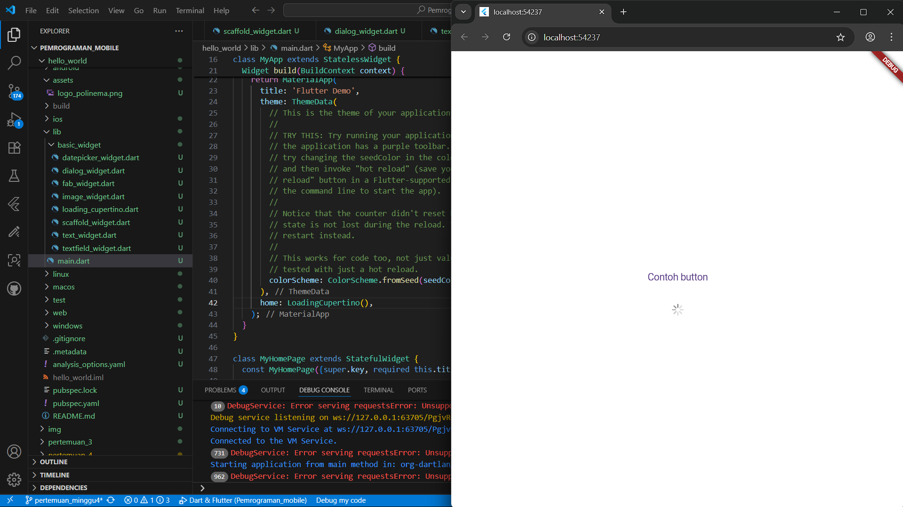

## Langkah 2: Floating Action Button (FAB)
Button widget terdapat beberapa macam pada flutter yaitu ButtonBar, DropdownButton, TextButton, FloatingActionButton, IconButton, OutlineButton, PopupMenuButton, dan ElevatedButton.

Buat file di basic_widgets > fab_widget.dart. Import stateless widget dari material. Lalu isi kode di dalam method Widget build adalah sebagai berikut.
```
return MaterialApp(
      home: Scaffold(
        floatingActionButton: FloatingActionButton(
          onPressed: () {
            // Add your onPressed code here!
          },
          child: const Icon(Icons.thumb_up),
          backgroundColor: Colors.pink,
        ),
      ),
    );
```
hasil dari langkah 2:
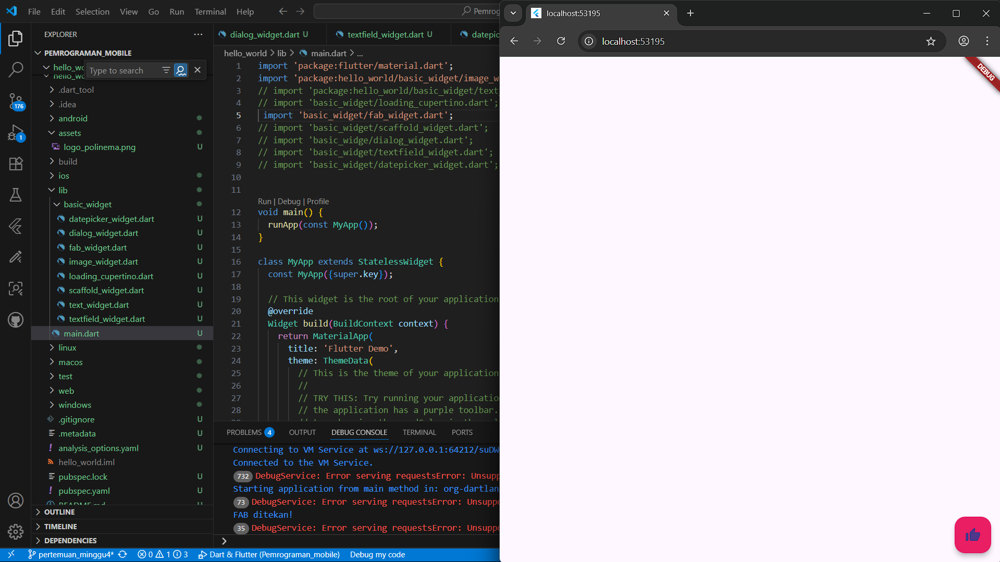

## Langkah 3: Scaffold Widget
Scaffold widget digunakan untuk mengatur tata letak sesuai dengan material design.

Ubah isi kode main.dart seperti berikut.
```
import 'package:flutter/material.dart';

void main() {
  runApp(const MyApp());
}

class MyApp extends StatelessWidget {
  const MyApp({Key? key}) : super(key: key);

  // This widget is the root of your application.
  @override
  Widget build(BuildContext context) {
    return MaterialApp(
      title: 'Flutter Demo',
      theme: ThemeData(
        primarySwatch: Colors.red,
      ),
      home: const MyHomePage(title: 'My Increment App'),
    );
  }
}

class MyHomePage extends StatefulWidget {
  const MyHomePage({Key? key, required this.title}) : super(key: key);

  final String title;

  @override
  State<MyHomePage> createState() => _MyHomePageState();
}

class _MyHomePageState extends State<MyHomePage> {
  int _counter = 0;

  void _incrementCounter() {
    setState(() {
      _counter++;
    });
  }

  @override
  Widget build(BuildContext context) {
    return Scaffold(
      appBar: AppBar(
        title: Text(widget.title),
      ),
      body: Center(
        child: Column(
          mainAxisAlignment: MainAxisAlignment.center,
          children: <Widget>[
            const Text(
              'You have pushed the button this many times:',
            ),
            Text(
              '$_counter',
              style: Theme.of(context).textTheme.headline4,
            ),
          ],
        ),
      ),
      bottomNavigationBar: BottomAppBar(
        child: Container(
          height: 50.0,
        ),
      ),
      floatingActionButton: FloatingActionButton(
        onPressed: _incrementCounter,
        tooltip: 'Increment Counter',
        child: const Icon(Icons.add),
      ), 
      floatingActionButtonLocation: FloatingActionButtonLocation.centerDocked,
    );
  }
}
```

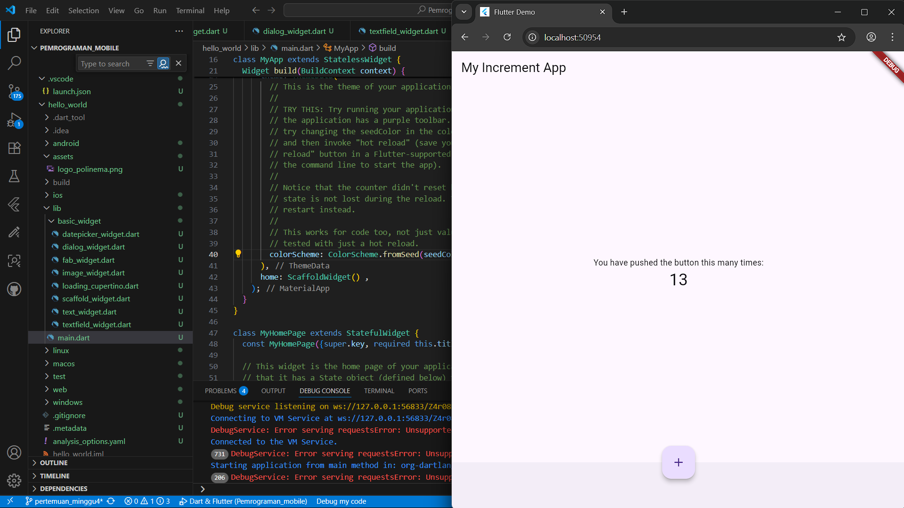

## Langkah 4: Dialog Widget
Dialog widget pada flutter memiliki dua jenis dialog yaitu AlertDialog dan SimpleDialog.

Ubah isi kode main.dart seperti berikut.
```
class MyApp extends StatelessWidget {
  const MyApp({Key? key}) : super(key: key);

  @override
  Widget build(BuildContext context) {
    return const MaterialApp(
      home: Scaffold(
        body: MyLayout(),
      ),
    );
  }
}

class MyLayout extends StatelessWidget {
  const MyLayout({Key? key}) : super(key: key);

  @override
  Widget build(BuildContext context) {
    return Padding(
      padding: const EdgeInsets.all(8.0),
      child: ElevatedButton(
        child: const Text('Show alert'),
        onPressed: () {
          showAlertDialog(context);
        },
      ),
    );
  }
}

showAlertDialog(BuildContext context) {
  // set up the button
  Widget okButton = TextButton(
    child: const Text("OK"),
    onPressed: () {
      Navigator.pop(context);
    },
  );

  // set up the AlertDialog
  AlertDialog alert = AlertDialog(
    title: const Text("My title"),
    content: const Text("This is my message."),
    actions: [
      okButton,
    ],
  );

  // show the dialog
  showDialog(
    context: context,
    builder: (BuildContext context) {
      return alert;
    },
  );
}
```
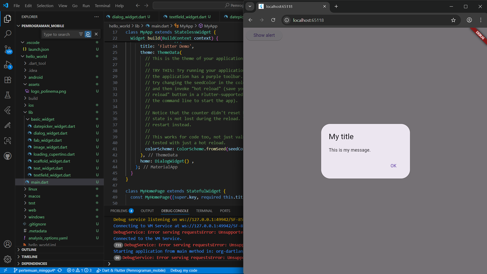

## Langkah 5: Input dan Selection Widget
Flutter menyediakan widget yang dapat menerima input dari pengguna aplikasi yaitu antara lain Checkbox, Date and Time Pickers, Radio Button, Slider, Switch, TextField.

Contoh penggunaan TextField widget adalah sebagai berikut:
```
class MyApp extends StatelessWidget {
  const MyApp({Key? key}) : super(key: key);

  @override
  Widget build(BuildContext context) {
    return MaterialApp(
      home: Scaffold(
        appBar: AppBar(title: const Text("Contoh TextField")),
        body: const TextField(
          obscureText: false,
          decoration: InputDecoration(
            border: OutlineInputBorder(),
            labelText: 'Nama',
          ),
        ),
      ),
    );
  }
}
```
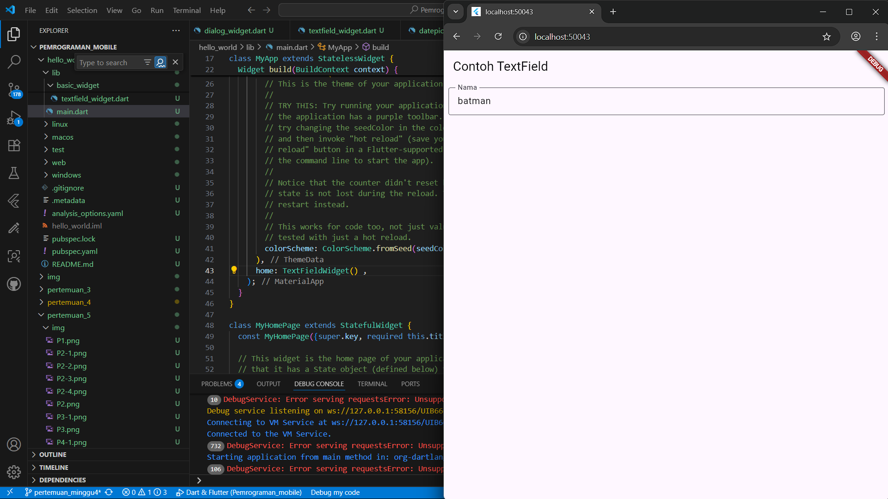

## Langkah 6: Date and Time Pickers
Date and Time Pickers termasuk pada kategori input dan selection widget, berikut adalah contoh penggunaan Date and Time Pickers.
```
import 'dart:async';
import 'package:flutter/material.dart';

void main() => runApp(const MyApp());

class MyApp extends StatelessWidget {
  const MyApp({Key? key}) : super(key: key);

  @override
  Widget build(BuildContext context) {
    return const MaterialApp(
      title: 'Contoh Date Picker',
      home: MyHomePage(title: 'Contoh Date Picker'),
    );
  }
}

class MyHomePage extends StatefulWidget {
  const MyHomePage({Key? key, required this.title}) : super(key: key);

  final String title;

  @override
  _MyHomePageState createState() => _MyHomePageState();
}

class _MyHomePageState extends State<MyHomePage> {
  // Variable/State untuk mengambil tanggal
  DateTime selectedDate = DateTime.now();

  //  Initial SelectDate FLutter
  Future<void> _selectDate(BuildContext context) async {
    // Initial DateTime FIinal Picked
    final DateTime? picked = await showDatePicker(
        context: context,
        initialDate: selectedDate,
        firstDate: DateTime(2015, 8),
        lastDate: DateTime(2101));
    if (picked != null && picked != selectedDate) {
      setState(() {
        selectedDate = picked;
      });
    }
  }

  @override
  Widget build(BuildContext context) {
    return Scaffold(
      appBar: AppBar(
        title: Text(widget.title),
      ),
      body: Center(
        child: Column(
          mainAxisSize: MainAxisSize.min,
          children: <Widget>[
            Text("${selectedDate.toLocal()}".split(' ')[0]),
            const SizedBox(
              height: 20.0,
            ),
            ElevatedButton(
              onPressed: () => {
                _selectDate(context),
                // ignore: avoid_print
                print(selectedDate.day + selectedDate.month + selectedDate.year)
              },
              child: const Text('Pilih Tanggal'),
            ),
          ],
        ),
      ),
    );
  }
}
```
hasil dari langkah 1:
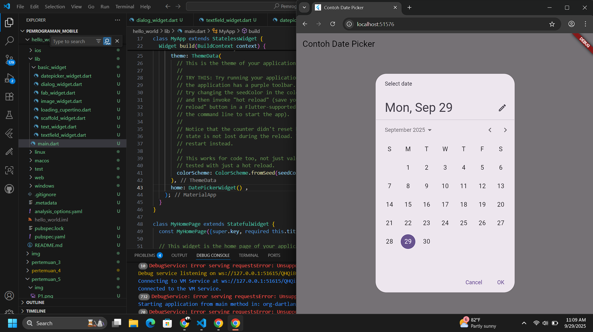

## Tugas praktikum 

1. selesaikan Praktikum 1 sampai 5, lalu dokumentasikan dan push ke repository Anda berupa screenshot setiap hasil pekerjaan beserta penjelasannya di file README.md!
2. Selesaikan Praktikum 2 dan Anda wajib menjalankan aplikasi hello_world pada perangkat fisik (device Android/iOS) agar Anda mempunyai pengalaman untuk menghubungkan ke perangkat fisik. Capture hasil aplikasi di perangkat, lalu buatlah laporan praktikum pada file README.md.
3. Pada praktikum 5 mulai dari Langkah 3 sampai 6, buatlah file widget tersendiri di folder basic_widgets, kemudian pada file main.dart cukup melakukan import widget sesuai masing-masing langkah tersebut!
4. Selesaikan Codelabs: Your first Flutter app, lalu buatlah laporan praktikumnya dan push ke repository GitHub Anda!
README.md berisi: capture hasil akhir tiap praktikum (side-by-side, bisa juga berupa file GIF agar terlihat proses perubahan ketika ada aksi dari pengguna) dengan menampilkan NIM dan Nama Anda sebagai ciri pekerjaan Anda.

