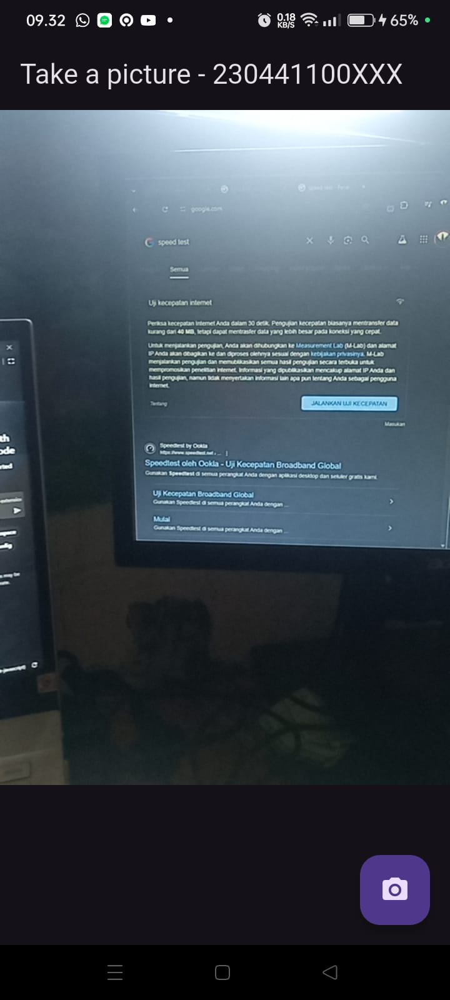
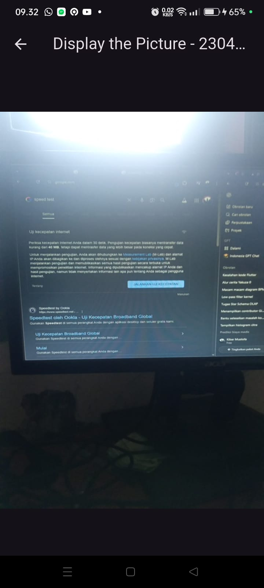
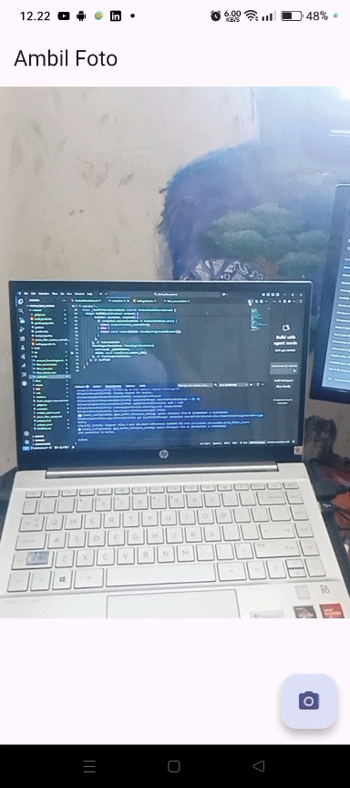

# praktikum 1 menerapkan fitur kamera pada flutter 

# praktikum 2 menerapkan filter carousell

# Tugas praktikum 
1. Selesaikan Praktikum 1 dan 2, lalu dokumentasikan dan push ke repository Anda berupa screenshot setiap hasil pekerjaan beserta penjelasannya di file README.md! Jika terdapat error atau kode yang tidak dapat berjalan, silakan Anda perbaiki sesuai tujuan aplikasi dibuat!
2. Gabungkan hasil praktikum 1 dengan hasil praktikum 2 sehingga setelah melakukan pengambilan foto, dapat dibuat filter carouselnya!

3. Jelaskan maksud void async pada praktikum 1?

- async berarti fungsi ini dapat menjalankan operasi yang memerlukan waktu lama (misalnya mengambil data dari internet, membaca file, atau menunggu input pengguna) tanpa menghentikan proses utama aplikasi. Dengan async, kamu bisa menggunakan keyword await di dalam fungsi tersebut untuk menunggu hasil dari operasi asinkron sebelum melanjutkan baris kode berikutnya.

4. Jelaskan fungsi dari anotasi @immutable dan @override ?

- @immutable

Digunakan untuk menandai bahwa class bersifat tidak dapat diubah (immutable).

Biasanya digunakan pada class widget di Flutter (seperti StatelessWidget).
Artinya: setelah objek dibuat, nilai dari atributnya tidak boleh diubah
